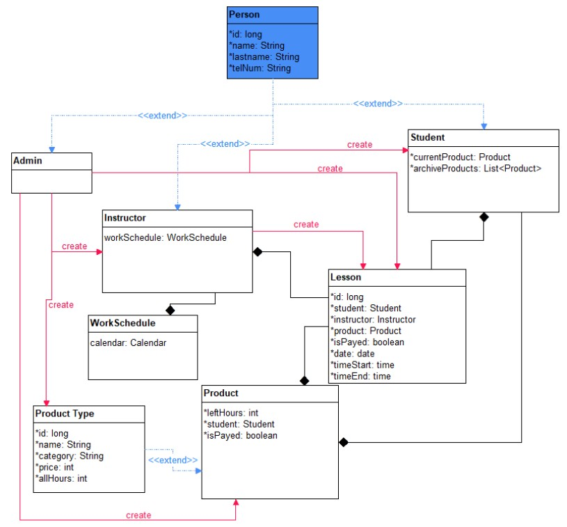
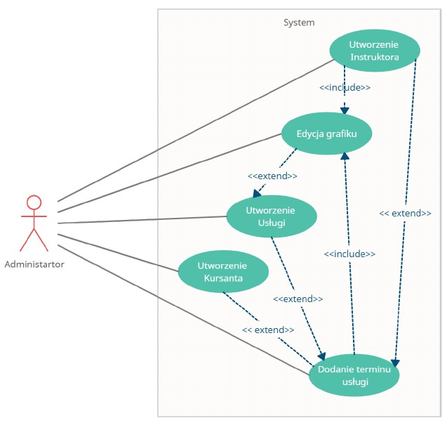

## Story

The aim of the project is to produce an integrated IT system a form of program for handling events in companies such as
driving school. Main design assumptions are based on use case diagrams and a simple form of interface.

### Technologies

* Angular
* Angular Material
* Tailwindcss

Backend api repo of the app in spring boot [here](https://github.com/luqkrzy/driva-api)

Scheme of the system functioning

Class diagram

Admin diagram
